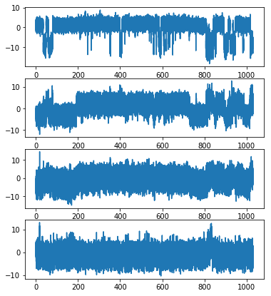
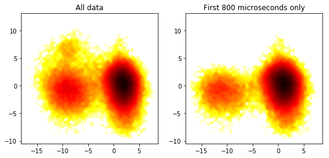

# PCA Analysis of the 1 millisecond BPTI Data

PCA analysis of the Shaw millisecond BPTI data (C-alpha atoms only, sampled every 10 nanoseconds) shows that the rare event recorded at c. 820 microseconds can be resolved in the PC1/PC4 space.


```python
# In this cell we use the pyPcazip library to do the PCA.
from MDPlus.core import Fasu, Cofasu
from MDPlus.analysis import pca
%matplotlib inline
import matplotlib.pyplot as plt
f = Fasu('bpti_ca_1ms_dt10ns.xtc', top='bpti_ca.pdb')
c = Cofasu(f)
print c.shape # This should give 103125 snapshots, each of 58 atoms, each with three (x,y,z) coordinates
p = pca.fromtrajectory(c)
print p.evals # The eigenvalues from the PCA analysis
```

    (103125, 58, 3)
    [ 17.03955661  10.25175029  10.17209174   4.82359665   3.77199073
       2.90853845   2.82133768   2.21039408   1.79439309   1.4943171
       1.40306523   1.32282016   1.00759207   0.94518943   0.77258149
       0.74642084   0.64891203   0.62547259   0.60379367   0.5464462
       0.53705644   0.51098362   0.46429252   0.43365739   0.39878905
       0.38368622   0.36693923   0.35251259]


```python
# In this cell we plot the time series for the trajectory projected along each of the 1st four PCs
plt.figure(figsize=(6, 7))
time = np.arange(len(c)) / 100.0
plt.subplot(4,1,1)
plt.plot(time, p.projs[0])
plt.subplot(4,1,2)
plt.plot(time, p.projs[1])
plt.subplot(4,1,3)
plt.plot(time, p.projs[2])
plt.subplot(4,1,4)
plt.plot(time, p.projs[3])
```


    [<matplotlib.lines.Line2D at 0x122e9c350>]





```python
# The rare event can be seen at about 820 microseconds in PC4. A 2-D plot in the PC1/PC4 space works well, 
# see the spot at (-10, 7):
plt.figure(figsize=(9, 4))
plt.subplot(1,2,1)
z,x,y = np.histogram2d(p.projs[0],p.projs[3], bins=50)
F = -np.log(z)
extent = [x[0], x[-1], y[0], y[-1]]
plt.title('All data')
plt.contourf(F.T, 50, cmap=plt.cm.hot, extent=extent)
plt.subplot(1,2,2)
z,x,y = np.histogram2d(p.projs[0][:80000],p.projs[3][:80000], bins=50)
F = -np.log(z)
plt.title('First 800 microseconds only')
plt.contourf(F.T, 50, cmap=plt.cm.hot, extent=extent)
```

    /Users/pazcal/Library/Python/2.7/lib/python/site-packages/ipykernel/__main__.py:5: RuntimeWarning: divide by zero encountered in log
    /Users/pazcal/Library/Python/2.7/lib/python/site-packages/ipykernel/__main__.py:11: RuntimeWarning: divide by zero encountered in log


    <matplotlib.contour.QuadContourSet at 0x11fa9d950>





## Conclusions and future directions

I suggest that we project all the trajectory data we collect in our investigation into the subspace defined by the Shaw data, and see how long it takes before we see samples in the (-10, 7) region. Hopefully this will take a lot less than 800 microseconds!


```python

```
